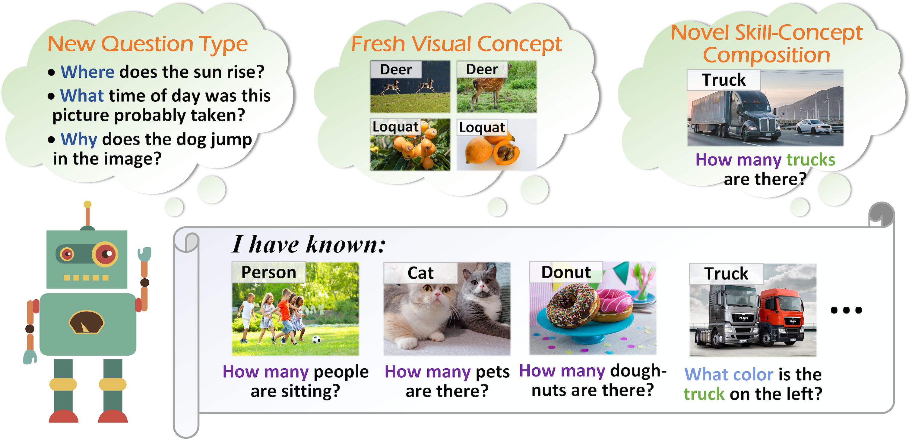
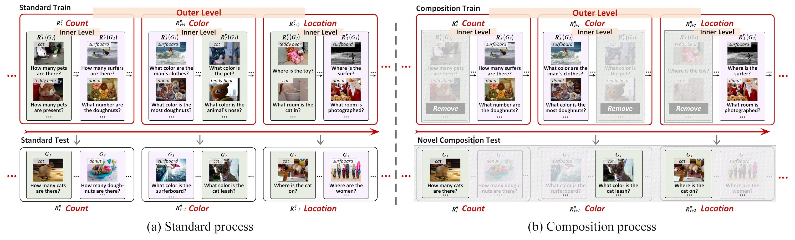
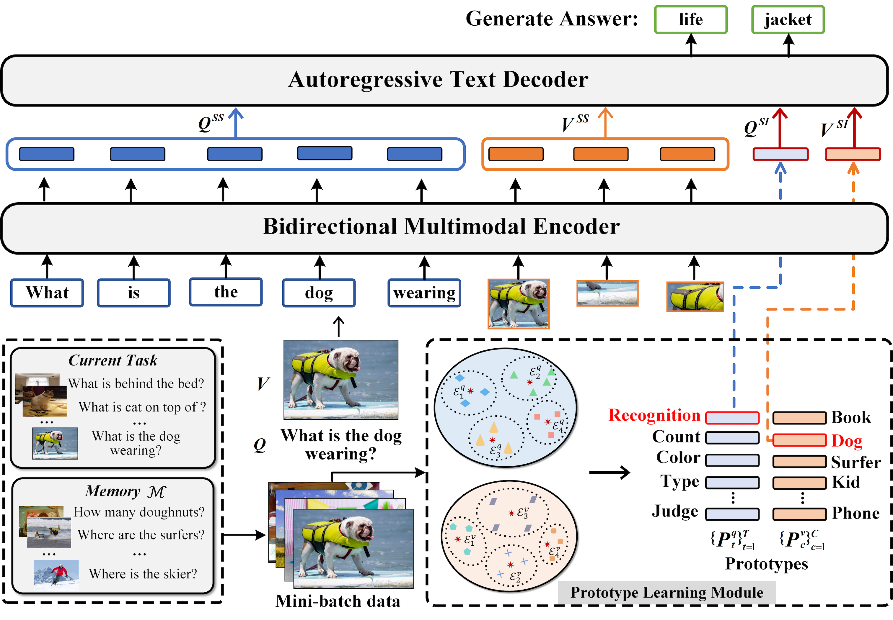
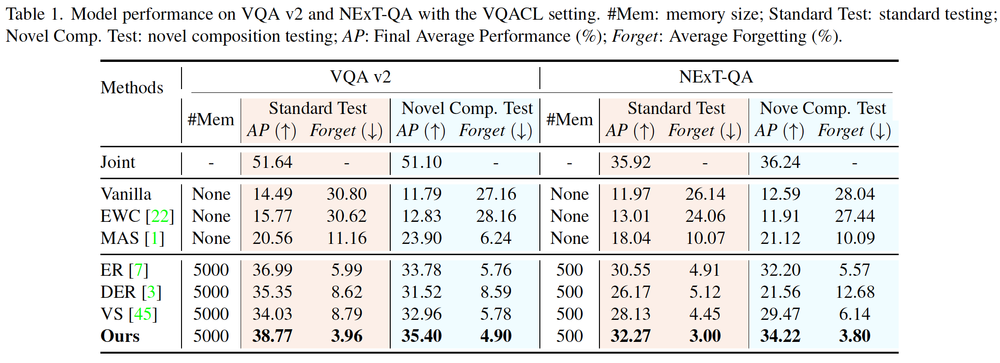

# VQACL: A Novel Visual Question Answering Continual Learning Setting  (accepted to CVPR2023)

<!--We establish a novel VQA Continual Learning setting named VQACL (accepted to CVPR2023), which contains two key components: a dual-level task sequence where visual and linguistic data are nested, and a novel composition testing containing new skill-concept combinations. The former devotes to simulating the ever-changing multimodal datastream in real world and the latter aims at measuring models’ generalizability for cognitive reasoning.

To do the VQACL, we also propose a novel representation learning method, which leverages a sample-specific and a sample-invariant feature to learn
representations that are both discriminative and generalizable for VQA.-->

## Introduction

### 1. Motivation and VQACL Setting
These years, most existing continual learning works focus on unimodal tasks such as image classification, and paid little attention to multimodal tasks like visual question answering (VQA). To cope with the constantly emerging real-world multimodal data, a practical AI system should be capable of continually learning from multimodal sources while alleviating forgetting previously learned knowledge.


<div align="center"></div>

In this paper, we design **a novel VQA continual learning setting named VQACL**. During the design, we consider two vital issues. 

First, as shown in Figure 1, the VQA input comes from both vision and linguistic modalities, thus the task setting should tackle multimodal continuous data in a holistic manner. To achieve it, as shown in Figure 2, imitating the cognitive process of children, we define a **dual-level task sequence**. Specifically, in the outer level, we set up a sequence of linguistic-driven tasks to evaluate for different question types. In the inner level, for each outer level task, we construct a series of randomly ordered visual-driven subtasks according to object categories.

Second, compositionality, a vital property of cognitive reasoning, should be considered in the VQA continual learning. The compositionality here denotes the model’s generalization ability towards novel combinations of reasoning skills (i.e., question type) and visual concepts (i.e., image object). To achieve it, we construct a **novel composition split**, where we remove a visual-driven subtask from each outer task during training, and utilize it for testing. In this way, the testing data contain novel skill-concept combinations that are not seen at the training time. 

In conclusion, on the one hand, our VQACL setting requires models to perform effective multimodal knowledge transfer from old tasks to new tasks while mitigating catastrophic forgetting. On the other hand, the model should be capable of generalizing to novel compositions for cognitive reasoning.



### 2. Method

We also propose a novel representation learning method for VQACL, which introduces a **sample-specific** (SS) and a **sample-invariant** (SI) feature to learn better representations that are both discriminative and generalizable. Specifically, the SS feature is learned through a transformer encoder, which can encode the most attractive and salient contents to make it discriminative. For the SI feature, we resort to prototype learning to aggregate object class or question type information. Because category knowledge is stable and representative across different scenarios, the SI feature can possess strong generalizability.

<div align="center"></div>

### 3. Experiment
During experiments, as shown in Table 1, we re-purpose and evaluate 5 well-known continual learning methods. The results indicate these models struggle to obtain satisfactory results. Remarkably, our model consistently achieves the best performance, demonstrating the effectiveness and compositionality of our approach.

<div align="center"></div>

## Setup
```bash
# Create python environment (optional)
conda create -n vqacl python=3.7
source activate vqacl

# Install python dependencies
pip install -r requirements.txt

# Download T5 backbone checkpoint
python download_backbones.py

```

## Code structure
```bash
# Store images, features, and annotations
./datasets
    COCO/
        images/
        features/
    vqa/
        Paritition_Q/
    nextqa/
        Paritition_Q/
    ...


# Training and testing in the VQACL setting
./VL-T5/
    src/
        modeling_t5_our.py                                    <= Our VL-T5 model classes
        vqacl.py vqacl_comp.py vqa_data.py vqa_model.py ...   <= Testing in the VQACL setting
        param.py                                              <= (argparse) configuration
        tokenization.py                                       <= custom tokenizer
        utils.py, dist_utils.py                               <= utility functions
    snap/                                                     <= store weight checkpoints
    scripts/                                                  <= bash scripts for evaluation
```

## Dataset Preparation / Model checkpoint
- Download the VQACL partition of VQA v2 from [Google Drive](https://drive.google.com/file/d/11gx7AxyeMP1KVuzHErIfNKCLeBWGq3pE/view?usp=share_link) and put it into datasets/nextqa/Partition_Q.
- Download the VQACL partition of NExT-QA from [Google Drive](https://drive.google.com/file/d/1lwWL_PhNKactFEqQF8IVx-HeJEuboe8D/view?usp=share_link) and put it into datasets/vqa/Partition_Q.
- Download `datasets/COCO` from [Google Drive](https://drive.google.com/drive/folders/1MBBhlkP83VMKS2Qe0SmFfzkHhMpIG5wf?usp=sharing)
- Download video features of NExT-QA from [Goolge Drive](https://drive.google.com/file/d/1rS5X_t_VSDF4uP3HL1gPQ0ZgWIEuglgk/view?usp=share_link) and put it into datatsets/nextqa/
- Download model checkpoints from [Google Drive](https://drive.google.com/drive/folders/1GDI9uG9OSQk0ObEaEJI3C6eKcDzh0yGp?usp=share_link)

## VQACL tasks

```bash
# Training with 1 gpu for VQA v2
cd VL-T5/
bash scripts/VQACL_train.sh 1 # Standard Training
bash scripts/VQACL_COMP_train.sh 1 # Training for Novel Composition Testing (Group-5)

# Testing with 1 gpu for VQA v2
cd VL-T5/
bash scripts/VQACL.sh 1 # Standard Testing
bash scripts/VQACL_COMP.sh 1 # Novel Composition Testing (Group-5)
```
## Citation
```
@InProceedings{zhang2023vqacl,
    author    = {Zhang, Xi and Zhang, Feifei and Xu, Changsheng},
    title     = {VQACL: A Novel Visual Question Answering Continual Learning Setting},
    booktitle = {Proceedings of the IEEE/CVF Conference on Computer Vision and Pattern Recognition (CVPR)},
    month     = {June},
    year      = {2023}
}
```

## Acknowledgement

Our model is based on the official [VL-T5](https://github.com/j-min/VL-T5) repository, we thank the authors to release their code. If you use the related part, please cite the corresponding paper commented in the code.
